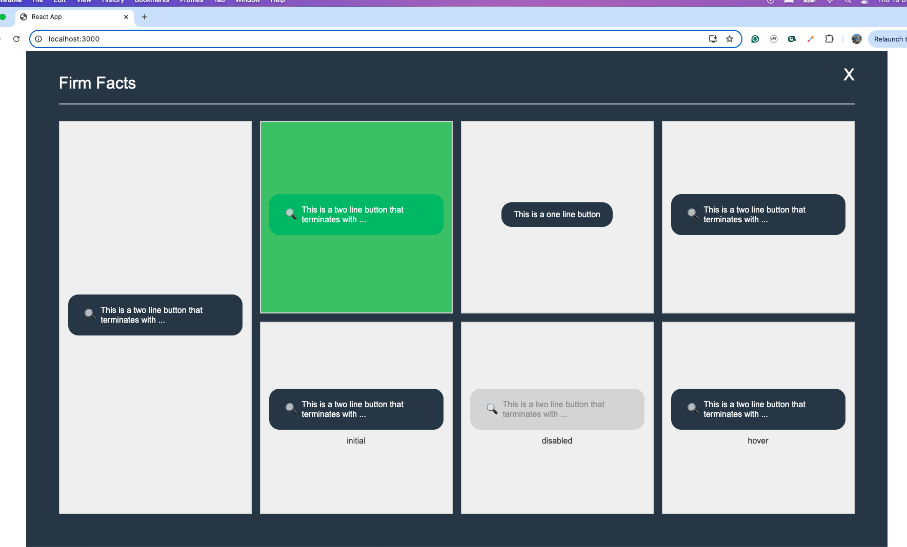

# Getting Started with Create React App

This project was bootstrapped with [Create React App](https://github.com/facebook/create-react-app).

## Author: Wellington Aquino

### Project Description

This project features a dynamic layout, with responsive components designed using React and SCSS. The layout includes a series of cards, and the page adapts based on screen sizes. The buttons within the cards have varying effects based on their content (e.g., hover effects and disabled states).

## Available Scripts

In the project directory, you can run:

### `yarn start`

Runs the app in the development mode.\
Open [http://localhost:3000](http://localhost:3000) to view it in the browser.

The page will reload if you make edits.\
You will also see any lint errors in the console.

### `node_modules`
The `node_modules` directory should always be excluded from GitHub. It was left in this particular case because the requirement says it should only call `yarn start`.

## Screenshot

Here is an image showing the running application:

## Contact

For any questions or feedback, feel free to reach out to Wellington Aquino.
